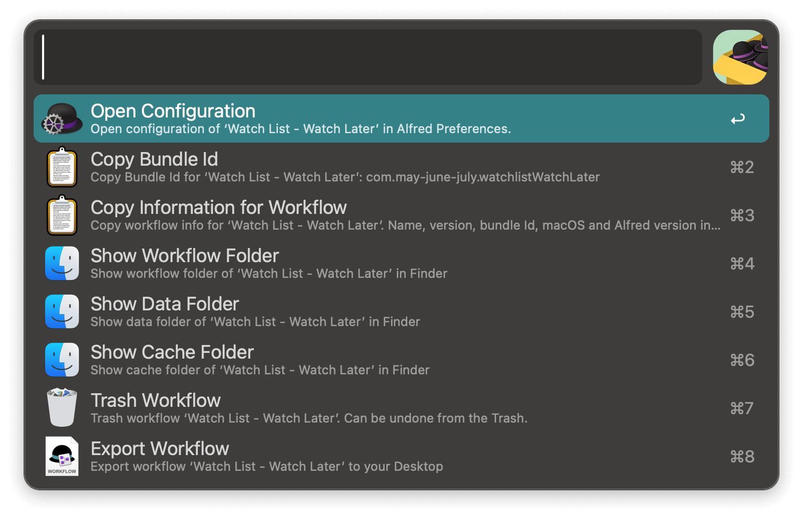

#  Workflow Finder — An Alfred Workflow

Find all your installed workflows and perform actions on them.

<!--  -->

## Installation

1. [➡️ Download the latest release](../../releases/latest)

2. Double click the `.alfredworkflow` file to install

Note that the [Alfred Powerpack](https://www.alfredapp.com/powerpack/) is required to use workflows.

If you want a workflow to find workflows from the [Alfred Gallery](https://alfred.app/), you should use [Alfred Gallery](https://alfred.app/workflows/alfredapp/alfred-gallery/) instead.

## Usage
- Search for workflows via the keyword `wflow` (configurable from [configuration](https://www.alfredapp.com/help/workflows/user-configuration/) pane).

- You can also search for workflows whose description contains the keyword or search for workflows by author.

- <kbd>↩</kbd> Edit the selected workflow. 
- <kbd>⌘</kbd><kbd>↩</kbd> Open the configuration window for the workflow. 
- <kbd>⌘</kbd><kbd>⇧</kbd><kbd>↩</kbd> Copy the bundle ID for the workflow.
- <kbd>⇧</kbd><kbd>↩</kbd> Open the workflow folder for the workflow.
- <kbd>⌃</kbd><kbd>↩</kbd> Open the data folder for the workflow.
- <kbd>⌥</kbd><kbd>⌃</kbd><kbd>↩</kbd> Open the cache folder for the workflow.
- <kbd>⇧</kbd><kbd>⌃</kbd><kbd>↩</kbd> Trash the workflow (can be undone in the Trash).
- <kbd>⌥</kbd><kbd>⇧</kbd><kbd>⌘</kbd><kbd>↩</kbd> Copy the title, bundle ID, version etc. for the workflow.
- <kbd>⌥</kbd><kbd>↩</kbd> Show all actions above for the selected workflow — including export the workflow to an `.alfredworkflow` file and Copy the workflow name. 

The copied info will contain title, bundle ID, version of the workflow (not this workflow), Alfred version, macOS version. Good for asking help about a workflow on the [Alfred Forum](https://www.alfredforum.com/forum/1-alfred-workflows/).

Info for this workflow:

`Workflow Finder・v0.1, bundle ID: com.may-june-july.listworkflows . Alfred version: 5.5.1 2273. macOS: 15.3.1.`

## License

This project is licensed under the [MIT license](./LICENSE).