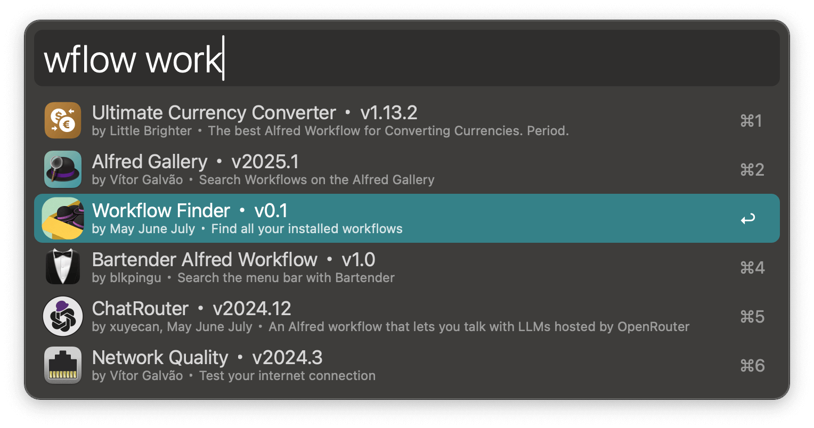
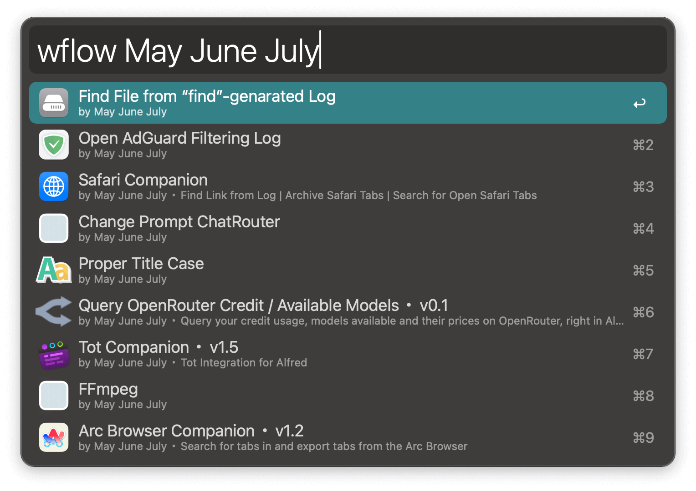

#  Workflow Finder Alfred Workflow

Finds all your installed worflows and perform actions on them.

<!--  -->

[➡️ Download the latest release.](https://github.com/{{repo}}/releases/latest)
 

If you want a workflow to find workflows from the [Alfred Gallery](https://alfred.app/), you should use [Alfred Gallery](https://alfred.app/workflows/alfredapp/alfred-gallery/) instead.

## Usage
- Search for workflows via the keyword `wflow` (configurable from [configuration](https://www.alfredapp.com/help/workflows/user-configuration/) pane).

- You can also search for workflows whose description contains the keyword or search for workflows by author.

- `↵` to edit the selected workflow. 
- `⌘↵` to open the configuration window for the workflow. 
- `⌘⇧↵` to copy the bundle ID for the workflow.
- `⇧↵` to pass the workflow folder for the workflow to [File Action](https://www.alfredapp.com/blog/tips-and-tricks/file-actions-from-alfred-or-finder/).
- `⌃↵` to pass the data folder for the workflow to File Action.
- `⌥⌃↵` to pass the cache folder for the workflow to File Action.
- `⇧⌃↵` to trash the workflow (can be undone in the Trash).
- `⌥⇧⌘↵` to copy the title, bundle ID, version etc. for the workflow.

The copied info will contain title, bundle ID, version of the workflow (not this workflow), Alfred version, macOS version. Good for asking help about a workflow on the [Alfred Forum](https://www.alfredforum.com/forum/1-alfred-workflows/).

Info for this workflow:

`Workflow Finder・v0.1, bundle ID: com.may-june-july.listworkflows . Alfred version: 5.5.1 2273. macOS: 15.3.1.`